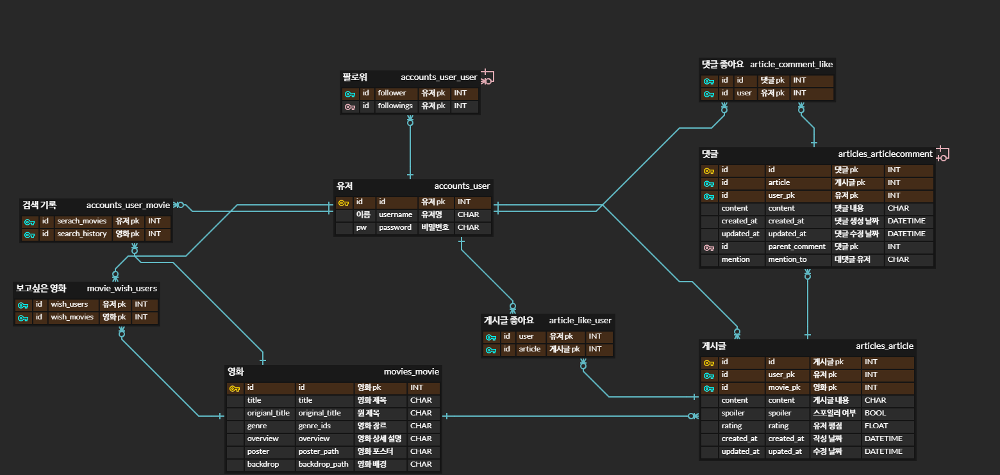

# cinema.log

# 1. 팀 소개

## 1.1. 팀 구성

- 김나연 : 멋쟁이 팀장
- 홍영민 : 멋쟁이 팀원

## 1.2. 업무 분담

- 김나연
    - 유저, 게시글 관련 기능 백/프론트 서버 구현
- 홍영민
    - API 활용 데이터 수집 및 전처리
    - 영화, 검색 관련 기능 백/프런트 서버 구현

# 2. 기획

## 2.1. 주제

- 영화 리뷰를 나눌 수 있는 소셜 네트워크 서비스

## 2.2. 기획 배경

- 코로나19로 인한 소통의 공백으로 주변인들과 공감대 형성의 중요성 대두
- 영화관 방문보다는 혼자 OTT서비스를 통해 영화를 즐기는 문화가 대세가 되어가며 영화에 대해 이야기를 나눌 환경이 적절하지 않음
- 현재의 영화 커뮤니티들(ex. 익스트림 무비, DVDPrime 등)은 익명 기반으로 운영되어 영화에 대한 정보를 얻을 수는 있지만 소통과 공감대 형성 효과는 비교적 부족함
- 이에 영화를 주제로 대화할 수 있도록 소셜 기능이 강조되는 서비스를 기획

## 2.3. 프로젝트 목표 및 실제 구현 정도

- 프로젝트 목표
    - 일반적인 소셜 네트워크 서비스의 구조를 담고 있으나 영화에 특화된 서비스를 목표로 함
    - 영화 후기를 작성하고, 친구의 후기에 댓글과 좋아요 등으로 상호작용함으로써 소통할 수 있는 서비스
    - 검색 및 추천 기능을 통해 영화의 정보를 효율적으로 전달
    - 대화의 장을 마련한다는 의도에 맞게 친구 관계를 중심으로 추천 기능을 구현하고자 함
- 실제 구현 정도
    - 소통에 필요한 커뮤니티의 CRUD 및 게시글 좋아요, 회원 팔로우 등의 기능은 목표한 정도로 구현
    - 기본적인 검색 기능 구현하였으나 키워드가 정확히 일치하지 않는 경우에는 작동하지 않음
    - 사용자의 데이터를 기반으로 한 영화 추천 기능 구현
    - 인간 관계를 기반으로 한 만큼 친구를 추천하는 기능이 가치 있겠으나 신규 회원을 대상으로 팔로워 수가 많은 친구를 추천하는 정도에 그침

# 3. 서비스 소개

## 3.1. 개발 환경

- 필수 개발 환경
    - Python 3.9.13
    - Django 3.2.13
    - Node.js 16.18.0
    - Vue 2 (@vue/cli 5.0.8)
    - JavaScript (npm 8.19.2)
    - Bootstrap 5.2.2
- 사용 아키텍처
    - DJango REST Framework & Vue

## 3.2. 활용 데이터

- TMDB
    - TMDB에서 제공하는 API를 활용하여 1380개의 인기 영화 데이터 수집

## 3.3. 데이터베이스 모델링

- ERD
  
    

## 3.4. 주요 기능

### 3.4.1. 유저 관련 기능

- 회원 가입 & 로그인 & 로그아웃
    - 회원가입과 로그인 모두 dj_rest_auth 라이브러리를 이용해 구현했다.
    - 소셜 네트워크 서비스에 기반을 둔 만큼, 로그인하지 않은 사용자는 서비스를 이용할 수 없도록 설계했다. 라우터 가드를 활용하여 로그인하지 않은 경우 로그인 화면에서 벗어나지 못하도록 하였다.
    - 로그아웃의 경우, 클릭과 동시에 로그아웃되며 이후 로그인 페이지로 돌아가도록 설정하였다.
- 비밀번호 변경 & 회원 탈퇴
    - 비밀번호 변경은 dj_rest_auth 라이브러리를 통해 구현했고, 회원 탈퇴는 직접 구현하였다.
    - 회원 탈퇴의 경우 자신의 유저네임을 동일하게 입력해야 탈퇴가 이루어질 수 있도록 하여 실수로 계정을 삭제하는 일을 방지하고자 했다.
- 프로필
    - 사용자의 게시글, 보고 싶어요를 누른 영화, 팔로워와 팔로잉 수를 확인할 수 있다. 각 요소들의 링크를 통해 세부 페이지로 이동해 자세한 정보를 확인할 수 있다.
    - 프로필 페이지에서 해당 사용자를 팔로우할 수 있다. 본인이 아닌 다른 사용자의 프로필에 방문한 경우 팔로우 버튼이 출력되며, 팔로우 결과는 실시간으로 팔로워 수에 적용된다.

### 3.4.2. 게시글 관련 기능

- 메인 페이지
    - 메인 페이지는 페이스북의 담벼락과 비슷한 역할을 하는 페이지로, 게시글 작성, 친구들의 게시글 리스트, 영화 추천 부분으로 구성되어 있다. 서비스의 주요 목적이 담긴 페이지로, 소통 부분을 강조했다.
    - 게시글 작성
        - 폼 내에서 원하는 영화를 검색한 뒤 별점과 스포일러 여부, 내용 작성 후 게시글을 등록할 수 있다.
    - 친구들의 게시글 확인
        - 나를 포함하여 내가 팔로우한 사용자들의 게시글이 최신 순으로 출력된다.
        - 사용자가 스포일러 체크를 한 게시글의 경우에는 바로 내용이 출력되지 않으며, 내용 확인하기를 한 번 더 눌러야 내용을 볼 수 있도록 구현했다.
        - 좋아요한 사람 목록과 댓글 목록은 버튼을 토글한 후 확인할 수 있다.
        - 좋아요와 댓글 기능을 통해 다른 유저들과 소통할 수 있도록 했다. 특히 대댓글 및 대댓글의 대댓글 기능을 구현하여 지속적인 대화가 이루어질 수 있도록 구현하였다.
        - 본인이 작성한 게시글, 댓글에 한해 수정과 삭제 버튼이 노출되며 수행 시 실시간으로 결과가 반영된다.
    - 영화 추천
        - 우측 하단 플로팅 버튼을 통해 영화 추천 페이지로 이동할 수 있다.
        - 추천 알고리즘은 3.5. 참고
    - 다만 위 기능들은 사용자가 팔로우한 사람이 있을 때 가치가 있다. 이에 방금 가입한 회원(= 팔로우한 사람이 없는 사용자)에게는 위 내용이 아닌 친구 추천 페이지가 출력된다.
- 게시글 디테일 페이지
    - 게시물의 경우 디테일 페이지가 추가로 구현되어 있다. 메인 페이지가 아닌 영화나 프로필 페이지에서 접근할 수 있다.
    - 같은 컴포넌트를 활용하여 출력 디자인은 메인 페이지에서와 동일하다.

### 3.4.3. 영화 관련 기능

- 영화 디테일 페이지
    - 영화에 대한 자세한 정보들이 담겨 있다.
    - 상단의 큰 이미지에는 평점, 원 제목, 장르 등의 주요 정보들이 출력된다.
    - 아래에는 추가적인 설명이 출력되는데, 해당 설명이 누락된 데이터가 많아 빈칸으로 출력 될 수 있다.
    - 유저 평점은 작성되는 리뷰들의 평균 평점으로, 서비스 내부 유저들만의 평점이다.
    - 하단에서는 해당 영화에 관련된 게시물의 리스트를 확인할 수 있다.
    - 게시물은 드래그를 활용하여 좌우로 넘길 수 있으며, 클릭 시 게시물 디테일 페이지로 이동한다.

### 3.4.4. 검색 관련 기능

- 검색 페이지
    - 영화, 게시글, 유저 검색을 동시에 수행할 수 있다.
    - DRF의 검색 필터링을 활용하여 특정 필드들을 기준으로 동일한 데이터를 찾는다.
    - 영화의 경우 제목과 원제목, 게시물의 경우 글의 내용, 유저의 경우 유저 이름이 검색 대상이 된다.
    - 검색 결과 목록은 하단에 그리드 배치되어 출력된다.
    - 검색 페이지에는 유저 편의성을 위한 기능이 두가지 존재한다.
        - 검색어가 빈칸일 경우, 페이지로 넘어가지 않고 경고 창을 띄운다.
        - 검색 결과가 없을 경우, 빈 결과 대신 결과가 없다는 문구가 출력된다.

### 3.4.5. 기타

- NavBar
    - 톱니바퀴 모양의 메뉴 버튼은 로그인 여부에 따라 포함하는 정보가 달라진다. 로그인 전에는 회원가입과 로그인 메뉴를, 로그인 후에는 설정과 로그아웃 메뉴를 보여준다.
    - 검색창의 경우 반응형으로 구현하였다. 큰 화면에서는 검색창에 키워드를 입력하여 바로 검색 결과 페이지로 이동할 수 있는 반면, 작은 화면에서는 검색창이 아닌 돋보기 아이콘을 클릭하여 검색을 할 수 있는 페이지로 이동한다. 이동된 페이지에서 키워드를 입력하며 검색 수행 시 하단에 검색 결과가 출력된다.
- 404 페이지
    - 존재하지 않는 URL로 직접 접근하거나, 존재하는 URL이지만 콘텐츠가 없는 경우 404 페이지로 연결했다.
    - 오류가 발생해도 유저가 분노를 느끼지 않길 바라며 귀여운 이미지를 삽입하였다.
- UX/UI
    - 전체적인 페이지의 구성은 반응형으로, 모바일 이상의 화면을 모두 고려하여 구현하였다.
    - 실제 서비스라고 생각하고 사용자의 경험에 신경 써서 서비스를 구현하고자 했다.

## 3.5. 추천 알고리즘

### 3.5.1. 영화 추천

- 메인 페이지 오른쪽 하단의 버튼을 통해 추천 페이지로 이동할 수 있다.
- 영화 추천은 두가지 종류로 이루어지며, 공통적으로 사용자 데이터에 기반하여 추천이 이루어진다.
    - 검색 기록 기반
        - 영화 상세 정보 조회를 한 경우 그 기록을 데이터베이스에 저장한다. 상세 조회를 영화에 대한 관심으로 해석하였고, 관심을 갖게 된 영화를 최근에 검색한 순으로 14개 추천한다.
        - 해당 14개의 영화 중 랜덤으로 한 편을 뽑아 오늘의 영화로 선정하고 추천 페이지 최상단에 노출한다.
    - 팔로우 기반
        - 대화의 장을 마련하고자 하는 서비스의 목적에 따라 친구가 본 영화를 같이 보고 이야기할 수 있도록 추천 알고리즘을 설계했다.
        - 유저가 팔로우한 친구들이 최근에 작성한 후기에 등장한 영화 중 유저가 본 영화를 제외한 14개 영화를 추천한다.
            - 유저가 본 영화인지 여부는 후기를 작성했는지 여부로 판단했는데, 시청 여부를 저장해둔다면 더 정교한 추천이 가능할 것 같다.
            - 최신 순이 아니라 친구들이 후기를 많이 올린 순으로 가중치를 둬서 추천하는 식으로 발전시킬 수 있을 것 같다.

### 3.5.2. 친구 추천

- 한 명도 팔로우를 한 명도 하지 않은 사용자에게는 소통을 유도하기 위하여 메인 페이지 대신 친구 추천 페이지가 출력된다.
- 유저 추천은 사용자 데이터 기반으로 이루어지진 않으며, 단순히 전체 유저 중 팔로워 수가 높은 5명의 사용자를 보여준다.

# 4. 소감

- 김나연
    - 프로젝트 첫 날을 되돌아보면 정말 막막했는데, 어떻게든 완성은 해서 뿌듯하기도 하지만 아쉬움이 더 크게 남는다. 더 효율적인 코드를 짤 수 있지 않았을까, 더 좋은 기능을 구현할 수 있지 않았을까 하는 생각이 든다.
    - 특히 마지막에 CSS에 빠져서.. 정작 중요한 추천 알고리즘 구현에 신경을 많이 못 썼다. 뭐가 더 중요한지 판단이 흐려졌다. 다음 프로젝트 때부터는 중요한 것에 더 노력을 들여야겠다는 깨달음을 얻었다.
    - 힘들고 스트레스 받고 소화도 안 되고 괴로웠지만.. 나름 재미있었다. 백엔드와 프론트엔드 모두 경험해보고 싶어서 기능 단위로 구현하며 협업했는데 둘 다 재미있어서 어느 쪽으로 가야 할 지 미궁에 빠졌다.
    - 페어인 영만이 덕분에 재밌게 잘 마무리했다. 나는 디테일에 집착하는 편인데 영만이는 효율성과 속도를 중시할 줄 아는 멋쟁이라서 도움을 많이 받았다. 영만이가 없었다면 나는 프로젝트를 끝내지 못했을 것이다. 열심히 갈려준 홍글로발~ 고맙다~~~
- 홍영민
    - 첫 개발 프로젝트로 기획과 아이디어 구현에 많은 우여곡절이 있었지만 만들어낸 결과물을 보고 참 아쉬움이 많이 남는 프로젝트였다. 처음에는 기획한 내용이 너무 나도 많아 시간 안에 마무리하기 어렵다고 생각했지만, 결국에는 원하는 기능들을 대부분 넣을 수 있었다
    - 하지만 마무리 단계에 와서는 기능도 아이디어 모두 부족함을 볼 수 있었다. 오류도 많고, 효율적인 코딩도 아니면서 동시에 관리도 어려운 코딩을 하고 있었다
    - 이러한 경험 들을 바탕으로 이후에 진행될 프로젝트에서는 반드시 협업에 필요한 베이스 룰을 지켜 나가며, 상호 간의 소통을 더 적절히 하면서 차근차근 프로젝트를 진행해 나가야 겠다
    - 그리고 팀장님은 정말 정리의 달인이시다. 만약 나 같은 사람 두 명 있었으면 정말 정리도 안되고 적당 적당 하다가 그만 끝이 나고 말았을 것이다.